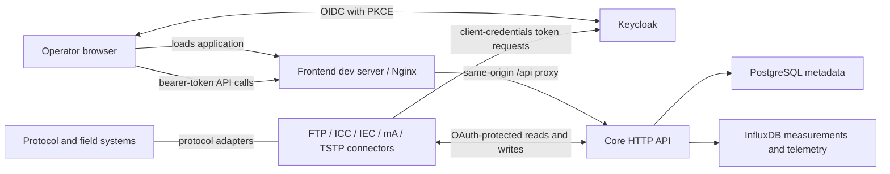

<p align="center">
  
</p>

# PegelHub

[](https://github.com/viadonau/pegelhub/actions/workflows/ci.yml)

PegelHub is viadonau's integration and monitoring platform for hydrological
station metadata and time-series measurements. It brings the Core HTTP API,
protocol-specific connectors, authenticated web frontend, local infrastructure,
and staging automation into one repository.

The repository is a monorepo, not a single runtime artifact. Core, the frontend,
and each connector retain their own build and container boundaries while sharing
one API contract, identity model, development environment, and deployment
topology.

## Capabilities

- Model station owners, stations, measuring points, and time series with
  explicit connector read access and source assignments.
- Integrate FTP, PegelHub Core, IEC 60870-5-104, Revolution Pi, and TSTP systems
  through independently deployable connectors.
- Store metadata in PostgreSQL and measurements and technical telemetry in
  separate InfluxDB buckets.
- Expose an OAuth 2.0-protected HTTP API with bilingual OpenAPI descriptions and
  a maintained Bruno collection.
- Present current and historical measurements in an authenticated,
  German-language monitoring interface.

> **Environment scope:** repository documentation and automation cover local
> development and a single-host staging environment. This repository does not
> claim a production topology, availability target, or production operations
> contract.

## Start locally

### Prerequisites

- Java 21 and Maven 3.9 for Core and connector builds
- Node.js 24 and npm 11.12.1 for frontend development
- Docker with Docker Compose v2
- Bash and `curl` for repository scripts

The browser and Core must use the same Keycloak issuer hostname. Add this entry
to the local hosts file before starting the stack:

```text
127.0.0.1 pegelhub-keycloak.test
```

From the repository root, create the ignored local environment file and start
Core with its dependencies:

```bash
test -f core/.env || cp core/.env.example core/.env
scripts/local-stack.sh compose-up
scripts/local-stack.sh health
```

`core/.env.example` contains disposable local credentials. Replace them in any
shared or remotely reachable environment.

Start the frontend development server in a second terminal:

```bash
npm --prefix frontend ci
npm --prefix frontend start
```

Open <http://localhost:4200/overview> and sign in with the browser account from
the [local Keycloak guide](core/docs/keycloak-local-dev.md#local-realm-contents).

The local environment exposes:

| Service | Local address |
| --- | --- |
| Frontend | <http://localhost:4200/overview> |
| Core API | <http://localhost:8080/api/v1> |
| Swagger UI | <http://localhost:8080/swagger-ui.html> |
| Actuator health | <http://localhost:8081/actuator/health> |
| Keycloak | <http://pegelhub-keycloak.test:8082> |
| PostgreSQL | `localhost:5444` |
| InfluxDB | <http://localhost:8111> |

The local-stack helper builds Core and starts PostgreSQL, InfluxDB, Keycloak,
and Core. The frontend remains a separate Node process so frontend changes can
reload independently.

Useful lifecycle commands:

```bash
scripts/local-stack.sh status
scripts/local-stack.sh logs
scripts/local-stack.sh compose-down
```

## Architecture



Core owns the hierarchy
`StationOwner -> Station -> MeasuringPoint -> TimeSeries`. PostgreSQL stores
that metadata, while InfluxDB stores measurements and technical telemetry in
separate buckets. The frontend consumes Core only through the HTTP API and does
not own or persist domain data.

The root Maven reactor intentionally builds Core and the connectors only. The
frontend keeps its native npm toolchain and container image under `frontend/`.
CI verifies both sides together, while delivery workflows publish and deploy
them independently.

## Repository layout

| Path | Responsibility |
| --- | --- |
| [`core/`](core/) | Spring Boot API, persistence, security, OpenAPI, and local Docker Compose stack |
| [`connectors/library/`](connectors/library/) | Shared connector runtime, Core client, OAuth client, configuration, and lifecycle |
| [`connectors/ftp-connector/`](connectors/ftp-connector/) | Imports ASC and ZRXP files from FTP |
| [`connectors/icc-connector/`](connectors/icc-connector/) | Transfers measurements between PegelHub Core instances |
| [`connectors/iec-connector/`](connectors/iec-connector/) | Exchanges measurements with IEC 60870-5-104 systems |
| [`connectors/ma-connector/`](connectors/ma-connector/) | Reads raw process-image values from Revolution Pi hardware |
| [`connectors/tstp-connector/`](connectors/tstp-connector/) | Exchanges measurements with the TSTP HTTP API |
| [`frontend/`](frontend/) | Angular monitoring application, browser runtime configuration, and frontend image |
| [`deploy/single-host/`](deploy/single-host/) | Reusable ingress, deployment scripts, TLS/trust policy, smoke tests, and rollback |
| [`deploy/connector/`](deploy/connector/) | Shared Compose runner for independently deployed connector instances |
| [`deploy/ansible/`](deploy/ansible/) | Debian and Ubuntu staging-host provisioning |
| [`docs/`](docs/) | Architecture documentation and decision records |
| [`.github/workflows/`](.github/workflows/) | Pull-request verification and independent image delivery workflows |
| [`scripts/`](scripts/) | Local-stack operations and connector image builds |

## Build and validation

Pull-request CI verifies the Java and frontend toolchains together. Run the
same primary checks from a clean checkout before submitting a change.

### Core and connectors

```bash
mvn -B -ntp -Pintegration verify
```

The `integration` profile includes Docker-backed integration tests and requires
Docker to be available to Maven.

Faster module checks:

```bash
mvn -B -ntp -pl core test
mvn -B -ntp -pl connectors/library -am test
mvn -B -ntp -f connectors/pom.xml test
```

Build one connector image with `scripts/build-connector-image.sh <connector>`.
Each connector README documents its configuration and protocol or hardware
requirements.

### Frontend

```bash
npm --prefix frontend ci
npm --prefix frontend run check
npm --prefix frontend run build
npm --prefix frontend run image:validate
```

Image validation requires Docker and `curl`. The
[frontend guide](frontend/README.md) documents faster commands, runtime
configuration, and live-stack smoke testing.

### Deployment configuration

Validate the local Compose model without starting it:

```bash
docker compose --env-file core/.env.example -f core/docker-compose.yaml config --quiet
```

The [CI workflow](.github/workflows/ci.yml) additionally validates staging
Compose models, Keycloak policy, frontend deployment behavior, and the
disposable staging Keycloak bootstrap.

## API contract

### Monitoring frontend

The authenticated frontend provides a filterable time-series overview and a
single-series detail view with metadata, the most recent reading returned by a
trailing-365-day query, and bucketed chart history. Its current scope is
monitoring; metadata administration is not implemented. See the
[frontend guide](frontend/README.md#product-surface) for the route and behavior
matrix.

### Core API

With Core running locally:

- Swagger UI: <http://localhost:8080/swagger-ui.html>
- English OpenAPI JSON: <http://localhost:8080/v3/api-docs?lang=en>
- German OpenAPI JSON: <http://localhost:8080/v3/api-docs?lang=de>
- English OpenAPI YAML: <http://localhost:8080/v3/api-docs.yaml?lang=en>
- German OpenAPI YAML: <http://localhost:8080/v3/api-docs.yaml?lang=de>

The running application generates the authoritative OpenAPI contract in both
languages. The repository-owned Bruno collection is a maintained set of
operator and connector smoke-test requests; it is not generated code or an
exhaustive operation-coverage checker.

On staging, Caddy exposes the same Core contract at
`https://$PEGELHUB_API_HOSTNAME` under `/swagger-ui.html`, `/v3/api-docs`, and
`/api/v1/...`.

## Security model

The browser authenticates with Keycloak through OIDC and PKCE S256. Connector
processes use the client-credentials flow. Core is a stateless OAuth 2.0
resource server: it validates JWT signatures through the configured issuer,
requires the `pegelhub-core-api` audience, and reads application roles only
from `resource_access.pegelhub-core-api.roles`.

The principal roles are:

- `metadata:read` and `metadata:write`
- `measurement:read` and `measurement:write`
- `telemetry:read` and `telemetry:write`
- `system:admin`

Measurement writes have an additional application policy: the caller must be
an active registered connector, every target time series must identify that
connector as its source, and the complete metadata hierarchy must be active.
Measurement reads for connector clients require an applicable station or
TimeSeries read-access relation. Connector clients must be active and
registered regardless of any `system:admin` role. The [Core guide](core/README.md#security-model)
contains the endpoint matrix and actor model.

## Delivery model

Core and connector images are published through the
[Images workflow](.github/workflows/images.yml). The frontend image uses the
[Frontend Delivery workflow](.github/workflows/frontend-delivery.yml). On an
eligible staging run, the Images workflow activates Core and the staging FTP
connector; the other connector images are published without an automatic
deployment. Frontend delivery activates its image independently. All three use
the shared staging deployment action.

The supported remote platform topology is a single Docker Compose host behind
Caddy. Connector instances run as separate Compose projects and may live on
that host or on the hardware/network where their external system is located.
The platform and frontend delivery paths share the GitHub `staging` Environment,
SSH configuration, deployment lock, and smoke checks, while keeping independent
release records and rollback commands. Automated FTP connector deployment uses
the same SSH action but has a Compose-only activation and no automatic rollback.
Operational procedures live in the
[single-host runbook](deploy/single-host/README.md) and the
[connector Compose runner](deploy/connector/README.md).

## Documentation

- [Core development and API guide](core/README.md)
- [Frontend development and monitoring guide](frontend/README.md)
- [Domain model and HTTP surface](docs/architecture/pegelhub-domain-model.md)
- [Architecture decision records](docs/adr/)
- [Local Keycloak realm and OAuth clients](core/docs/keycloak-local-dev.md)
- [InfluxDB buckets, retention, and time handling](core/docs/influxdb.md)
- [Single-host deployment and rollback](deploy/single-host/README.md)
- [Independent connector Compose deployments](deploy/connector/README.md)
- [Staging host provisioning](deploy/ansible/README.md)
- [Bruno API collection](core/docs/api/bruno/README.md)

## License

PegelHub is licensed under the [GNU General Public License v3.0](LICENSE).
