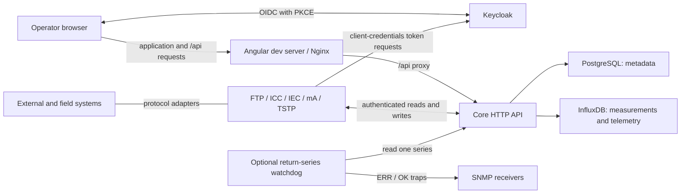

<p align="center">
  
</p>

# PegelHub

[](https://github.com/viadonau/pegelhub/actions/workflows/ci.yml)

PegelHub is viadonau's platform for exchanging and monitoring hydrological
measurements. It connects field and data systems to a shared HTTP API, stores
station metadata and time-series measurements, and provides an authenticated
web interface for viewing current readings and historical data.

This repository contains the Core API, five protocol-specific connectors, the
Angular frontend, an optional return-series watchdog, and the tooling to build,
test, and deploy them. Each application runs independently; this is not a single
executable or container.

## Capabilities

- **Organize measurement data:** manage station owners, stations, measuring
  points, time series, and connector access through the Core API.
- **Exchange measurements:** import FTP files and Revolution Pi process-image
  values, transfer data between Core instances, and integrate IEC 60870-5-104
  and TSTP systems.
- **Monitor time series:** browse a German-language overview and inspect
  individual series with metadata, latest readings, and historical charts.
- **Control access:** authenticate users and service clients with Keycloak;
  restrict connector writes to their assigned source series and reads to
  explicitly granted series or stations.
- **Supervise a return route:** optionally monitor the freshness of one existing
  return series and emit SNMP error/recovery events with the
  [watchdog](tools/e2e-watchdog/README.md). This does not verify every sample or
  measurement value.

The web interface is for monitoring, not metadata administration. Metadata is
managed through the API. Repository automation covers local development and
single-host staging; it does not establish a production availability or
operations guarantee.

## Start Locally

Run the commands below from the repository root. The local stack starts Core,
PostgreSQL, InfluxDB, and Keycloak. The frontend runs separately for live reload;
connectors and the watchdog are not started automatically.

### Prerequisites

- Docker with Docker Compose v2 and a running Docker daemon.
- Node.js 24 and npm (the frontend declares `npm@11.12.1`).
- Bash and `curl` for the local-stack helper.
- Free local ports: `4200`, `5444`, `8080`, `8081`, `8082`, and `8111`.

Java 21 and Maven 3.9 are needed for host-side Java builds and tests, but not for
this Docker-based startup: the Core image builds with its own Maven and JDK.

### 1. Configure Local Name Resolution

The browser and Core must agree on Keycloak's issuer hostname. Add this entry
to your hosts file (`/etc/hosts` on Linux/macOS):

```text
127.0.0.1 pegelhub-keycloak.test
```

### 2. Start Core and Its Dependencies

```bash
test -f core/.env || cp core/.env.example core/.env
scripts/local-stack.sh compose-up
scripts/local-stack.sh health
```

The helper builds Core and waits for its health endpoint. The environment file
is ignored by Git; the command preserves an existing `core/.env`. The example
configuration contains disposable local credentials and publishes service
ports without a loopback-only restriction. Use it only on a trusted development
machine, not on a shared or publicly reachable host.

### 3. Start the Frontend

```bash
npm --prefix frontend ci
npm --prefix frontend start
```

Open [the monitoring overview](http://localhost:4200/overview). A freshly
imported local realm provides the disposable browser account `pegel` with
password `local-dev-passphrase`. See the
[local Keycloak guide](core/docs/keycloak-local-dev.md#local-realm-contents) for
the realm, roles, and other test clients. Existing Keycloak volumes are not
overwritten by a new realm import.

A fresh database has no station or measurement dataset. An empty overview is
expected until metadata and source assignments are created through the API and
measurements are submitted by an authorized connector. The
[Bruno collection](core/docs/api/bruno/README.md) documents that workflow.

### Local Endpoints and Lifecycle

| Service | Address |
| --- | --- |
| Frontend | <http://localhost:4200/overview> |
| Core API | <http://localhost:8080/api/v1> |
| Swagger UI | <http://localhost:8080/swagger-ui.html> |
| Core health | <http://localhost:8081/actuator/health> |
| Keycloak | <http://pegelhub-keycloak.test:8082> |
| PostgreSQL metadata database | `localhost:5444` |
| InfluxDB | <http://localhost:8111> |

```bash
scripts/local-stack.sh status
scripts/local-stack.sh logs all
scripts/local-stack.sh compose-down
```

`compose-down` removes the local containers and network but retains database
volumes. Stop the frontend separately with `Ctrl+C` in its terminal. For
host-side Core development or startup troubleshooting, use the
[Core guide](core/README.md) and [local Keycloak guide](core/docs/keycloak-local-dev.md).

## Architecture



Core owns the metadata hierarchy
`StationOwner -> Station -> MeasuringPoint -> TimeSeries`. PostgreSQL stores
this hierarchy and access assignments. InfluxDB stores measurements and
technical telemetry in separate buckets. The frontend uses the Core API; it
does not access either database directly.

Connectors translate between external systems and Core. Their supported
directions, timestamp handling, configuration, and recovery behavior differ by
protocol and are documented in their respective guides. The watchdog is an
independent, read-only process, not another ingestion connector.

## Repository Guide

| Component | Responsibility and documentation |
| --- | --- |
| [Core](core/README.md) | Spring Boot API, metadata, measurements, security, migrations, and local infrastructure |
| [Frontend](frontend/README.md) | Angular monitoring UI, development, runtime configuration, and browser tests |
| [Connector library](connectors/library/README.md) | Shared configuration, lifecycle, OAuth, and Core client |
| [FTP connector](connectors/ftp-connector/README.md) | Import ASC and ZRXP files from FTP |
| [ICC connector](connectors/icc-connector/README.md) | Transfer measurements between Core instances |
| [IEC connector](connectors/iec-connector/README.md) | Exchange measurements with IEC 60870-5-104 systems |
| [mA connector](connectors/ma-connector/README.md) | Read raw process-image values on Revolution Pi hardware |
| [TSTP connector](connectors/tstp-connector/README.md) | Exchange measurements through the TSTP HTTP protocol |
| [Watchdog](tools/e2e-watchdog/README.md) | Return-series freshness monitoring; [isolated two-Core test lab](tools/e2e-watchdog/lab/README.md) |
| [Single-host deployment](deploy/single-host/README.md) | Platform ingress, TLS, deployment, smoke checks, and rollback |
| [Connector deployment](deploy/connector/README.md) | Separate Compose projects for connector instances |
| [Ansible provisioning](deploy/ansible/README.md) | Prepare a Debian/Ubuntu staging host |
| [Java container runtime](docker/README.md) | Shared entrypoint and optional custom CA trust |

## Build and Validation

Run these commands from the repository root. Java builds require Java 21 and
Maven 3.9; frontend checks use Node.js 24. Docker-backed checks also require a
running Docker daemon.

### Java

The root Maven reactor includes Core, the connector modules, and the watchdog.
The `integration` profile adds Docker-backed Core integration tests:

```bash
mvn -B -ntp -Pintegration verify
```

For a narrower change, run the relevant module and its reactor dependencies:

```bash
mvn -B -ntp -pl core test
mvn -B -ntp -f connectors/pom.xml test
mvn -B -ntp -pl tools/e2e-watchdog -am verify
```

Build a connector image with, for example,
`scripts/build-connector-image.sh ftp-connector`. Hardware and external protocol
requirements are listed in each connector guide.

### Frontend

```bash
npm --prefix frontend ci
npm --prefix frontend run check
npm --prefix frontend run build
npm --prefix frontend run image:validate
```

`check` runs formatting, type checks, and unit tests. Image validation requires
Docker and `curl`. CI additionally runs coverage and Chromium browser tests;
their setup and commands are in the [frontend guide](frontend/README.md#verification).

### Configuration and CI

Validate the local Compose configuration without starting services:

```bash
docker compose --env-file core/.env.example -f core/docker-compose.yaml config --quiet
```

The [CI workflow](.github/workflows/ci.yml) also checks staging and connector
Compose configurations, Java trust handling, frontend deployment behavior,
certificate installation, and disposable Keycloak bootstrap. The separate
[Watchdog Image workflow](.github/workflows/watchdog.yml) verifies the watchdog
image and lab configuration. These checks do not replace live protocol or
deployment acceptance testing.

## API Contract

Core generates its OpenAPI contract at runtime. With Core running locally:

- [Swagger UI](http://localhost:8080/swagger-ui.html)
- [English OpenAPI JSON](http://localhost:8080/v3/api-docs?lang=en)
- [German OpenAPI JSON](http://localhost:8080/v3/api-docs?lang=de)

For YAML, use `/v3/api-docs.yaml?lang=en` or `?lang=de`. The
[Bruno collection](core/docs/api/bruno/README.md) supplies maintained operator
and connector examples, not exhaustive coverage of every API operation.

See the [domain model](docs/architecture/pegelhub-domain-model.md) for terminology
and the [architecture decisions](docs/adr/) for design rationale.

## Security Model

Browser users sign in through Keycloak using OIDC with PKCE S256. Service
clients use the OAuth 2.0 client-credentials flow. Core validates JWTs, requires
the `pegelhub-core-api` audience, and reads application roles from that client's
role claim.

API roles alone do not authorize a connector to write to arbitrary series.
Measurement writes require an active registered connector, a matching source
assignment, and an active metadata hierarchy. Connector reads require an
explicit station or time-series read grant. See the
[Core security model](core/README.md#security-model) for actor types, endpoint
permissions, and administrative exceptions.

## Delivery Model

- [Images](.github/workflows/images.yml) publishes Core and the five connector
  images. Eligible staging runs deploy Core, then the staging FTP connector;
  the other connector images are published without automatic deployment.
- [Frontend Delivery](.github/workflows/frontend-delivery.yml) builds,
  publishes, and independently deploys a digest-pinned frontend image.
- [Watchdog Image](.github/workflows/watchdog.yml) can publish the watchdog
  through an explicit workflow input. It never deploys it.

The single-host platform uses Docker Compose behind Caddy. Connector instances
run as separate Compose projects on a host with access to their external
systems. Platform/frontend deployment scripts provide smoke checks and
rollback; connector activation does not provide automatic rollback. Follow the
[single-host runbook](deploy/single-host/README.md) or
[connector runbook](deploy/connector/README.md), rather than using the local
development stack for a remote installation.

## License

PegelHub is licensed under the [GNU General Public License v3.0](LICENSE).
