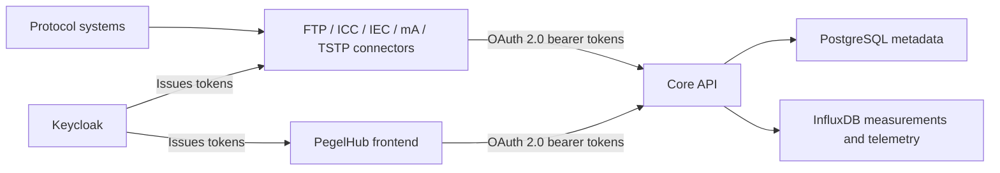

<p align="center">
  
</p>

# PegelHub

[](https://github.com/viadonau/pegelhub/actions/workflows/ci.yml)

PegelHub is an application for hydrological station metadata and time-series
measurements. This repository contains the Core HTTP API, protocol-specific
connectors, Angular monitoring frontend, local infrastructure, and the
repository-owned staging deployment. Core and the frontend remain separate
deployables with independent toolchains and container images.

> **Deployment scope:** the repository defines local development and a
> single-host staging topology. It does not currently define a production
> topology, availability target, or production operations contract.

## Start locally

### Prerequisites

- Java 21 and Maven 3.9 for host-side builds
- Node.js 24 and npm 11.12.1 for frontend development
- Docker with Docker Compose v2
- Bash and `curl` for the local-stack helper

From the repository root:

```bash
test -f core/.env || cp core/.env.example core/.env
scripts/local-stack.sh compose-up
scripts/local-stack.sh health
```

`core/.env.example` contains disposable local credentials. Replace them for
any shared or remotely reachable environment.

Host-side browser and token flows use the same issuer hostname that Core
validates. Add `127.0.0.1 pegelhub-keycloak.test` to the local hosts file; do
not substitute `localhost` in the issuer URL.

With Core running, start the frontend in a second terminal:

```bash
npm --prefix frontend ci
npm --prefix frontend start
```

Open <http://localhost:4200/overview> and sign in with the local browser user
from the [Keycloak guide](core/docs/keycloak-local-dev.md#local-realm-contents).

The helper builds Core and starts PostgreSQL, InfluxDB, Keycloak, and Core. The
default local addresses are:

| Service | URL |
| --- | --- |
| Core API prefix | <http://localhost:8080/api/v1> |
| Swagger UI | <http://localhost:8080/swagger-ui.html> |
| Actuator health | <http://localhost:8081/actuator/health> |
| Keycloak | <http://pegelhub-keycloak.test:8082> |
| PostgreSQL | `localhost:5444` |
| InfluxDB | <http://localhost:8111> |

Useful lifecycle commands:

```bash
scripts/local-stack.sh status
scripts/local-stack.sh logs
scripts/local-stack.sh compose-down
```

## Architecture



Core owns the hierarchy
`StationOwner -> Station -> MeasuringPoint -> TimeSeries` and keeps metadata
in PostgreSQL. Measurements and technical telemetry are stored in separate
InfluxDB buckets. Keycloak issues the OAuth 2.0 bearer tokens used
by browser and service clients.

## Repository map

| Path | Purpose |
| --- | --- |
| [`core/`](core/) | Spring Boot API, persistence, security, OpenAPI, and local Docker Compose stack |
| [`connectors/library/`](connectors/library/) | Shared connector runtime, configuration, OAuth client, mapping loader, and measurement model |
| [`connectors/ftp-connector/`](connectors/ftp-connector/) | Imports ASC and ZRXP files from FTP |
| [`connectors/icc-connector/`](connectors/icc-connector/) | Transfers measurements between two PegelHub Core instances |
| [`connectors/iec-connector/`](connectors/iec-connector/) | Exchanges measurements with IEC 60870-5-104 systems |
| [`connectors/ma-connector/`](connectors/ma-connector/) | Reads raw process-image input values from Revolution Pi hardware |
| [`connectors/tstp-connector/`](connectors/tstp-connector/) | Exchanges measurements with the TSTP HTTP API |
| [`frontend/`](frontend/) | Angular monitoring application, browser runtime configuration, and frontend image |
| [`deploy/staging/`](deploy/staging/) | Single-host staging deployment, policy checks, bootstrap, smoke tests, and rollback scripts |
| [`deploy/ansible/`](deploy/ansible/) | Debian/Ubuntu staging-host provisioning |
| [`scripts/`](scripts/) | Local stack helpers and connector image builds |

## Build and validation

Run the Maven reactor used by CI:

```bash
mvn -B -ntp -Pintegration verify
```

The `integration` profile enables Docker-backed integration tests. Docker must
therefore be available to the Maven process.

Faster module checks:

```bash
mvn -B -ntp -pl core test
mvn -B -ntp -pl connectors/library -am test
mvn -B -ntp -f connectors/pom.xml test
```

Validate the local Compose model without starting it:

```bash
docker compose --env-file core/.env.example -f core/docker-compose.yaml config --quiet
```

Frontend checks use the Node toolchain in `frontend/`:

```bash
npm --prefix frontend ci
npm --prefix frontend run check
npm --prefix frontend run build
```

Build one connector image with `scripts/build-connector-image.sh <connector>`.
Individual connector READMEs document their runtime configuration and hardware
or protocol requirements.

## API contract

With Core running locally:

- Swagger UI: <http://localhost:8080/swagger-ui.html>
- English OpenAPI JSON: <http://localhost:8080/v3/api-docs?lang=en>
- German OpenAPI JSON: <http://localhost:8080/v3/api-docs?lang=de>
- English OpenAPI YAML: <http://localhost:8080/v3/api-docs.yaml?lang=en>
- German OpenAPI YAML: <http://localhost:8080/v3/api-docs.yaml?lang=de>

The OpenAPI documents are generated from the running application. CI checks
that both language variants expose the same operations and that the maintained
Bruno collection covers those operations and their query parameters.

On staging, Caddy exposes the same contract at
`https://$PEGELHUB_API_HOSTNAME` under `/swagger-ui.html`, `/v3/api-docs`, and
`/api/v1/...`. The repository does not define a production endpoint.

## Security model

Core is an OAuth 2.0 resource server. It validates JWT signatures through the
configured issuer and requires the `pegelhub-core-api` audience. Application
roles are read only from `resource_access.pegelhub-core-api.roles`.

The principal roles are:

- `metadata:read` and `metadata:write`
- `measurement:read` and `measurement:write`
- `telemetry:read` and `telemetry:write`
- `system:admin`

Measurement writes have an additional application-level policy: the caller
must be an active registered connector, every target time series must identify
that connector as its source, and a direct TimeSeries `WRITE` grant must exist.
Measurement reads for non-admin connector clients require an applicable `READ`
grant. See the [Core README](core/README.md) for the endpoint matrix and actor
model.

## Documentation

- [Core development and API guide](core/README.md)
- [Frontend development and monitoring guide](frontend/README.md)
- [Current domain model and HTTP surface](docs/architecture/pegelhub-domain-model.md)
- [Local Keycloak realm and OAuth clients](core/docs/keycloak-local-dev.md)
- [InfluxDB buckets, retention, and time handling](core/docs/influxdb.md)
- [Staging deployment and rollback](deploy/staging/README.md)
- [Staging host provisioning](deploy/ansible/README.md)
- [Bruno API collection](core/docs/api/bruno/README.md)

## License

PegelHub is licensed under the [GNU General Public License v3.0](LICENSE).
