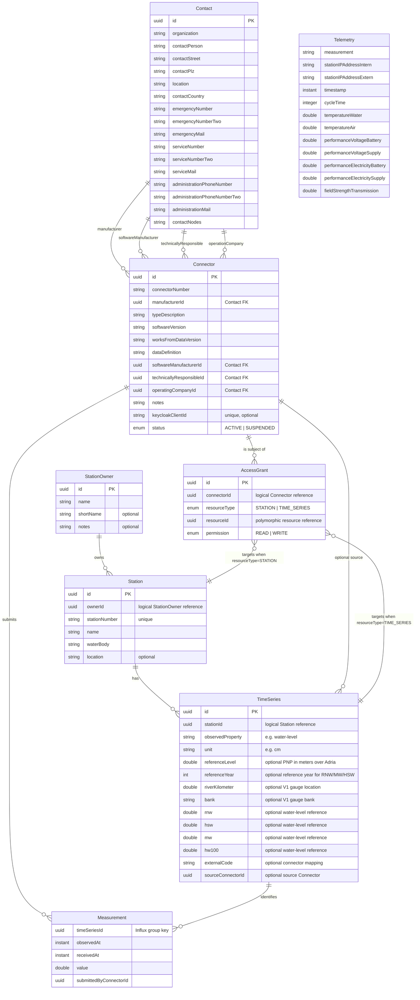
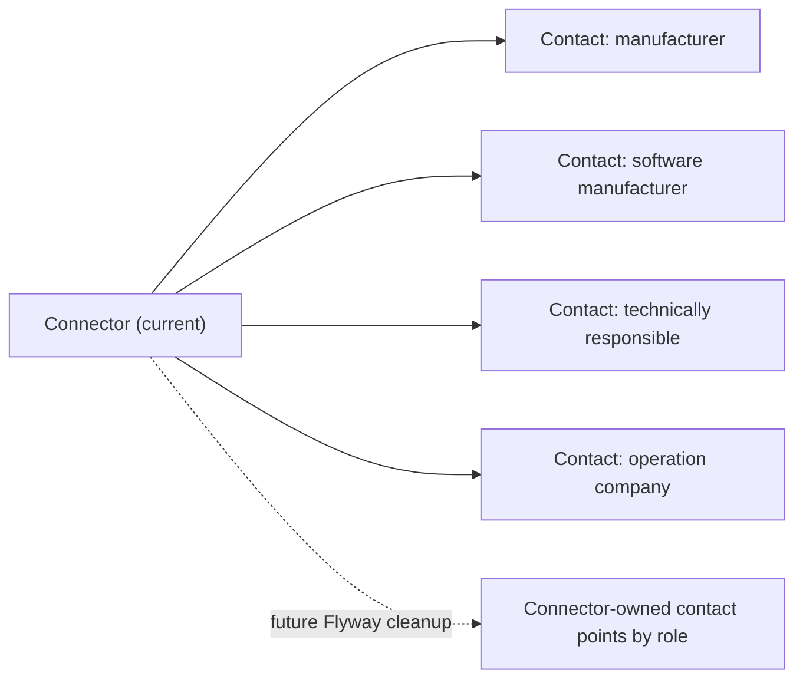
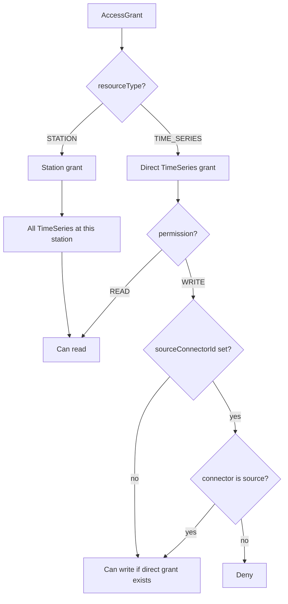
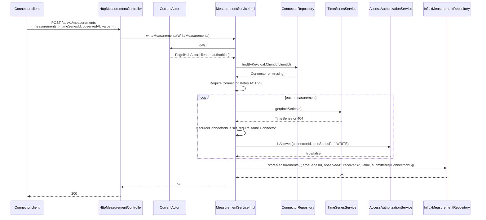
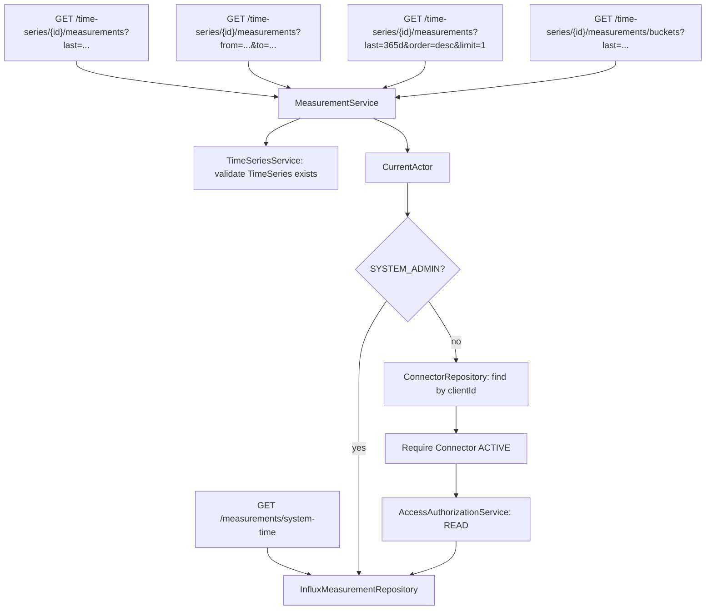

# PegelHub Domain Model

This document describes the current branch state after the domain migration. It intentionally shows remaining legacy pieces where they still exist, especially connector contact metadata and telemetry.

## Logical Model

The diagram is logical, not a guarantee that every relationship is already enforced by a database foreign key. The first migration pass still relies partly on Hibernate-managed schema updates. Full Flyway ownership, metadata FKs, access-grant reshaping, and connector contact reshaping are follow-up work.



## Deferred Model Cleanup

The current connector/contact shape is intentionally still legacy-shaped. `Contact` is still a standalone resource and `Connector` still owns four required contact references. The preferred follow-up direction is to replace that with connector-owned, role-based contact points once Flyway/schema migrations are introduced.



PNP, gauge-location, and water-level reference metadata currently lives directly on `TimeSeries` as a V1 simplification. Extract a `MeasuringPoint` between `Station` and `TimeSeries` when multiple series share one bank/kilometer/reference set or when left/right/device identity needs an independent lifecycle.

## Authorization Cascade



Station grants are read-only and cover all TimeSeries at the station. Direct TimeSeries `WRITE` grants are rejected when the TimeSeries has a different `sourceConnectorId`.

## Measurement Write Path



## Measurement Read Path



## API Surface

The security column names the effective Spring Security rule. Most metadata routes accept `METADATA_READ`, `METADATA_WRITE`, or `SYSTEM_ADMIN` for reads, and `METADATA_WRITE` or `SYSTEM_ADMIN` for writes/deletes.

| Method | Path | Auth | Description |
|--------|------|------|-------------|
| POST | `/api/v1/measurements` | `MEASUREMENT_WRITE` | Write measurements |
| GET | `/api/v1/time-series/{timeSeriesId}/measurements?last={duration}` | `MEASUREMENT_READ` or `SYSTEM_ADMIN` | Raw TimeSeries measurements in a relative window |
| GET | `/api/v1/time-series/{timeSeriesId}/measurements?from={instant}&to={instant}` | `MEASUREMENT_READ` or `SYSTEM_ADMIN` | Raw TimeSeries measurements in an explicit window |
| GET | `/api/v1/time-series/{timeSeriesId}/measurements?last={duration}&order=desc&limit=1` | `MEASUREMENT_READ` or `SYSTEM_ADMIN` | Latest value for TimeSeries through the paged raw query |
| GET | `/api/v1/time-series/{timeSeriesId}/measurements/buckets?last={duration}` | `MEASUREMENT_READ` or `SYSTEM_ADMIN` | Average buckets for chart-ready TimeSeries reads |
| GET | `/api/v1/measurements/system-time` | public | InfluxDB system time |
| POST | `/api/v1/admin/connectors` | `SYSTEM_ADMIN` | Register connector identity binding |
| POST | `/api/v1/connectors` | `METADATA_WRITE` or `SYSTEM_ADMIN` | Create connector metadata |
| GET | `/api/v1/connectors` | `METADATA_READ`, `METADATA_WRITE`, or `SYSTEM_ADMIN` | List connectors |
| GET | `/api/v1/connectors/{uuid}` | `METADATA_READ`, `METADATA_WRITE`, or `SYSTEM_ADMIN` | Get connector |
| DELETE | `/api/v1/connectors/{uuid}` | `METADATA_WRITE` or `SYSTEM_ADMIN` | Delete connector |
| POST | `/api/v1/contact` | `METADATA_WRITE` or `SYSTEM_ADMIN` | Create legacy contact |
| GET | `/api/v1/contact` | `METADATA_READ`, `METADATA_WRITE`, or `SYSTEM_ADMIN` | List legacy contacts |
| GET | `/api/v1/contact/{uuid}` | `METADATA_READ`, `METADATA_WRITE`, or `SYSTEM_ADMIN` | Get legacy contact |
| DELETE | `/api/v1/contact/{uuid}` | `METADATA_WRITE` or `SYSTEM_ADMIN` | Delete legacy contact |
| POST | `/api/v1/station-owners` | `METADATA_WRITE` or `SYSTEM_ADMIN` | Create station owner |
| GET | `/api/v1/station-owners` | `METADATA_READ`, `METADATA_WRITE`, or `SYSTEM_ADMIN` | List station owners |
| GET | `/api/v1/station-owners/{id}` | `METADATA_READ`, `METADATA_WRITE`, or `SYSTEM_ADMIN` | Get station owner |
| POST | `/api/v1/stations` | `METADATA_WRITE` or `SYSTEM_ADMIN` | Create station |
| GET | `/api/v1/stations` | `METADATA_READ`, `METADATA_WRITE`, or `SYSTEM_ADMIN` | List stations |
| GET | `/api/v1/stations/{id}` | `METADATA_READ`, `METADATA_WRITE`, or `SYSTEM_ADMIN` | Get station |
| POST | `/api/v1/time-series` | `METADATA_WRITE` or `SYSTEM_ADMIN` | Create time series |
| GET | `/api/v1/time-series` | `METADATA_READ`, `METADATA_WRITE`, or `SYSTEM_ADMIN` | List time series, optionally filtered by `stationId` |
| GET | `/api/v1/time-series/{id}` | `METADATA_READ`, `METADATA_WRITE`, or `SYSTEM_ADMIN` | Get time series |
| POST | `/api/v1/access-grants` | `METADATA_WRITE` or `SYSTEM_ADMIN` | Create access grant |
| GET | `/api/v1/access-grants` | `METADATA_READ`, `METADATA_WRITE`, or `SYSTEM_ADMIN` | List access grants, optionally filtered by `connectorId` |
| GET | `/api/v1/access-grants/{id}` | `METADATA_READ`, `METADATA_WRITE`, or `SYSTEM_ADMIN` | Get access grant |
| POST | `/api/v1/telemetry` | `TELEMETRY_WRITE` or `SYSTEM_ADMIN` | Write technical telemetry |
| GET | `/api/v1/telemetry/{range}` | `TELEMETRY_READ` or `SYSTEM_ADMIN` | Query telemetry by range |
| GET | `/api/v1/telemetry/last/{uuid}` | `TELEMETRY_READ` or `SYSTEM_ADMIN` | Query latest telemetry for id |

## Package Structure

```text
core/src/main/java/at/pegelhub/
├── stationowner/       StationOwner API/application/domain/persistence
├── station/            Station API/application/domain/persistence
├── timeseries/         TimeSeries API/application/domain/persistence
├── access/             AccessGrant API/application/domain/persistence
├── measurement/        TimeSeries-backed Measurement write/read API and Influx persistence
├── connector/          Connector metadata, Keycloak client binding, legacy contact references
├── contact/            Legacy standalone Contact resource used by Connector
├── telemetry/          Technical telemetry, still domain-as-API
├── security/           Keycloak resource server, authority mapping, current actor
└── shared/
    ├── influx/         InfluxDB configuration, query helpers, point helpers
    ├── persistence/    Legacy Contact entity/domain converters
    ├── validation/     Validation and normalization helpers
    └── web/            Legacy Contact DTO/domain converters
```

## Known Follow-Up Areas

- Introduce Flyway with a curated baseline and move Hibernate to schema validation.
- Add database-level FKs and indexes for metadata relationships.
- Reshape `AccessGrant` persistence away from polymorphic `resourceType/resourceId`.
- Replace standalone Contact CRUD and four connector contact FKs with connector-owned role-based contact points.
- Standardize measurement and telemetry response DTOs.
- Refactor connector configuration and remove remaining legacy contact/config duplication.
