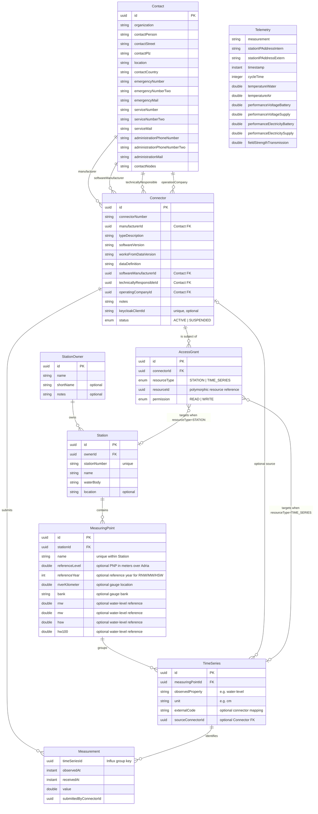
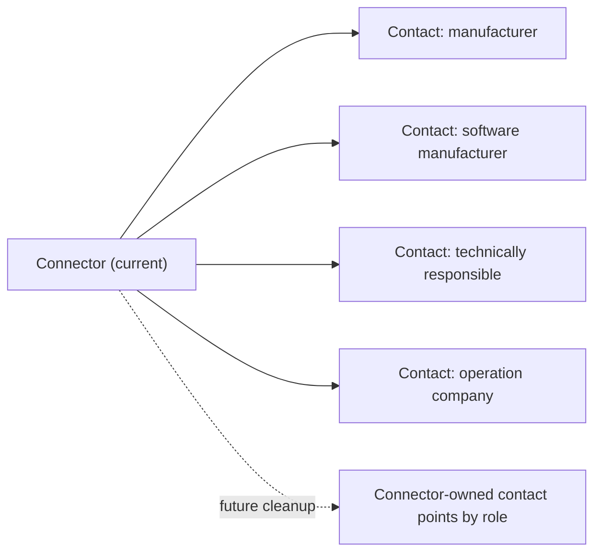
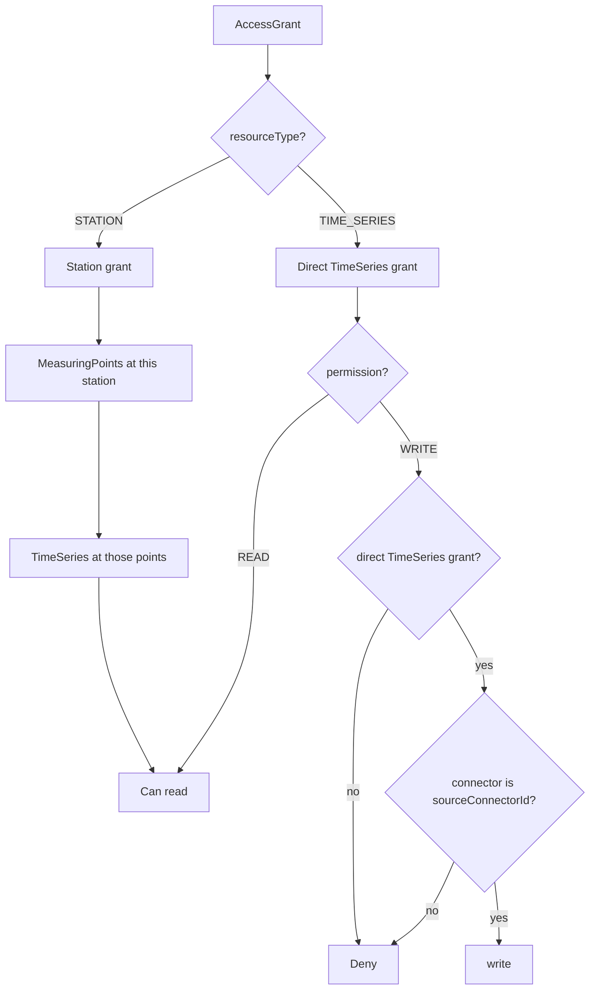
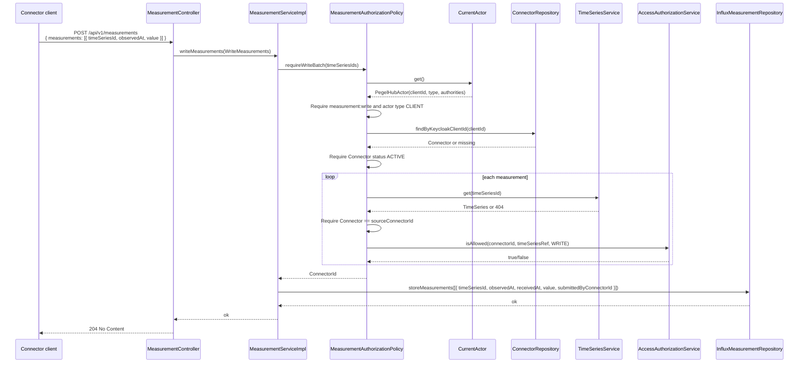
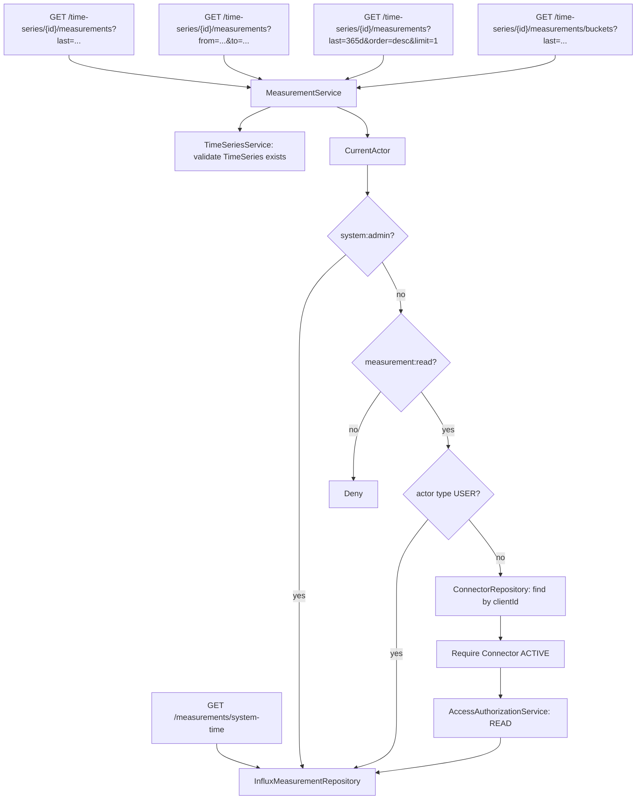

# PegelHub Domain Model

This document describes the domain model and HTTP surface implemented in the
current repository. It shows retained legacy structures where they still
exist, especially connector contact metadata and telemetry.

## Logical Model

Flyway owns the relational metadata schema, and Hibernate validates the
resulting shape at startup. The polymorphic AccessGrant target and legacy
Connector contact shape remain deliberate exceptions to otherwise explicit
metadata relationships.


```mermaid
erDiagram
    StationOwner ||--o{ Station : owns
    Station ||--o{ MeasuringPoint : contains
    MeasuringPoint ||--o{ TimeSeries : groups
    Connector o|--o{ TimeSeries : "optional source"
    Connector ||--o{ AccessGrant : "is subject of"
    AccessGrant }o--o| Station : "targets when resourceType=STATION"
    AccessGrant }o--o| TimeSeries : "targets when resourceType=TIME_SERIES"
    Connector ||--o{ Measurement : submits
    TimeSeries ||--o{ Measurement : identifies

    Contact ||--o{ Connector : manufacturer
    Contact ||--o{ Connector : softwareManufacturer
    Contact ||--o{ Connector : technicallyResponsible
    Contact ||--o{ Connector : operationCompany

    StationOwner {
        uuid id PK
        string name
        string shortName "optional"
        string notes "optional"
    }

    Station {
        uuid id PK
        uuid ownerId FK
        string stationNumber "unique"
        string name
        string waterBody
        string location "optional"
    }

    MeasuringPoint {
        uuid id PK
        uuid stationId FK
        string name "unique within Station"
        double referenceLevel "optional PNP in meters over Adria"
        int referenceYear "optional reference year for RNW/MW/HSW"
        double riverKilometer "optional gauge location"
        string bank "optional gauge bank"
        double rnw "optional water-level reference"
        double mw "optional water-level reference"
        double hsw "optional water-level reference"
        double hw100 "optional water-level reference"
    }

    TimeSeries {
        uuid id PK
        uuid measuringPointId FK
        string observedProperty "e.g. water-level"
        string unit "e.g. cm"
        string externalCode "optional connector mapping"
        uuid sourceConnectorId "optional Connector FK"
    }

    AccessGrant {
        uuid id PK
        uuid connectorId FK
        enum resourceType "STATION | TIME_SERIES"
        uuid resourceId "polymorphic resource reference"
        enum permission "READ | WRITE"
    }

    Connector {
        uuid id PK
        string connectorNumber
        uuid manufacturerId "Contact FK"
        string typeDescription
        string softwareVersion
        string worksFromDataVersion
        string dataDefinition
        uuid softwareManufacturerId "Contact FK"
        uuid technicallyResponsibleId "Contact FK"
        uuid operatingCompanyId "Contact FK"
        string notes
        string keycloakClientId "unique, optional"
        enum status "ACTIVE | SUSPENDED"
    }

    Contact {
        uuid id PK
        string organization
        string contactPerson
        string contactStreet
        string contactPlz
        string location
        string contactCountry
        string emergencyNumber
        string emergencyNumberTwo
        string emergencyMail
        string serviceNumber
        string serviceNumberTwo
        string serviceMail
        string administrationPhoneNumber
        string administrationPhoneNumberTwo
        string administrationMail
        string contactNodes
    }

    Measurement {
        uuid timeSeriesId "Influx group key"
        instant observedAt
        instant receivedAt
        double value
        uuid submittedByConnectorId
    }

    Telemetry {
        string measurement
        string stationIPAddressIntern
        string stationIPAddressExtern
        instant timestamp
        integer cycleTime
        double temperatureWater
        double temperatureAir
        double performanceVoltageBattery
        double performanceVoltageSupply
        double performanceElectricityBattery
        double performanceElectricitySupply
        double fieldStrengthTransmission
    }
```

## Deferred Model Cleanup

The current connector/contact shape is intentionally still legacy-shaped.
`Contact` remains a standalone resource, and `Connector` owns four required
contact references. The preferred follow-up direction is to replace that with
connector-owned, role-based contact points through a separate staged migration.


```mermaid
flowchart LR
    Connector["Connector (current)"] --> Manufacturer["Contact: manufacturer"]
    Connector --> SoftwareManufacturer["Contact: software manufacturer"]
    Connector --> TechnicalResponsible["Contact: technically responsible"]
    Connector --> OperationCompany["Contact: operation company"]

    Connector -. "future cleanup" .-> ContactPoints["Connector-owned contact points by role"]
```

## Authorization Cascade


```mermaid
flowchart TD
    grant[AccessGrant] --> check{resourceType?}

    check -->|TIME_SERIES| direct[Direct TimeSeries grant]
    check -->|STATION| stationGrant[Station grant]

    direct --> perm{permission?}
    stationGrant --> stationPoints[MeasuringPoints at this station]
    stationPoints --> stationSeries[TimeSeries at those points]
    stationSeries --> read[Can read]

    perm -->|READ| read
    perm -->|WRITE| directWrite{direct TimeSeries grant?}
    directWrite -->|no| deny[Deny]
    directWrite -->|yes| sameSource{connector is sourceConnectorId?}
    sameSource -->|yes| write
    sameSource -->|no| deny
```

Station grants are read-only and cover all TimeSeries below the Station's
MeasuringPoints. A measurement write requires both a direct TimeSeries `WRITE`
grant and an exact match between the active Connector and the TimeSeries
`sourceConnectorId`. A missing or different source denies the write.

## Measurement Write Path


```mermaid
sequenceDiagram
    participant C as Connector client
    participant MC as MeasurementController
    participant MS as MeasurementServiceImpl
    participant AP as MeasurementAuthorizationPolicy
    participant CA as CurrentActor
    participant CR as ConnectorRepository
    participant TS as TimeSeriesService
    participant AA as AccessAuthorizationService
    participant MR as InfluxMeasurementRepository

    C->>MC: POST /api/v1/measurements<br/>{ measurements: [{ timeSeriesId, observedAt, value }] }
    MC->>MS: writeMeasurements(WriteMeasurements)
    MS->>AP: requireWriteBatch(timeSeriesIds)
    AP->>CA: get()
    CA-->>AP: PegelHubActor(clientId, type, authorities)
    AP->>AP: Require measurement:write and actor type CLIENT
    AP->>CR: findByKeycloakClientId(clientId)
    CR-->>AP: Connector or missing
    AP->>AP: Require Connector status ACTIVE

    loop each measurement
        AP->>TS: get(timeSeriesId)
        TS-->>AP: TimeSeries or 404
        AP->>AP: Require Connector == sourceConnectorId
        AP->>AA: isAllowed(connectorId, timeSeriesRef, WRITE)
        AA-->>AP: true/false
    end

    AP-->>MS: ConnectorId
    MS->>MR: storeMeasurements([{ timeSeriesId, observedAt, receivedAt, value, submittedByConnectorId }])
    MR-->>MS: ok
    MS-->>MC: ok
    MC-->>C: 204 No Content
```

## Measurement Read Path

Raw reads always use a bounded relative or explicit time window, deterministic
ordering, and a limit of at most 10,000 points. When a response sets
`truncated`, the requested window contains additional points; callers should
narrow that time window. Chart reads use the bucket endpoint instead.


```mermaid
flowchart TD
    A["GET /time-series/{id}/measurements?last=..."] --> MS[MeasurementService]
    B["GET /time-series/{id}/measurements?from=...&to=..."] --> MS
    C["GET /time-series/{id}/measurements?last=365d&order=desc&limit=1"] --> MS
    E["GET /time-series/{id}/measurements/buckets?last=..."] --> MS
    D["GET /measurements/system-time"] --> MR[InfluxMeasurementRepository]

    MS --> TS["TimeSeriesService: validate TimeSeries exists"]
    MS --> Actor["CurrentActor"]
    Actor --> Admin{system:admin?}
    Admin -->|yes| MR
    Admin -->|no| ReadRole{measurement:read?}
    ReadRole -->|no| Denied[Deny]
    ReadRole -->|yes| User{actor type USER?}
    User -->|yes| MR
    User -->|no| ConnectorLookup["ConnectorRepository: find by clientId"]
    ConnectorLookup --> Active["Require Connector ACTIVE"]
    Active --> Auth["AccessAuthorizationService: READ"]
    Auth --> MR
```

## API Surface

The security column names the effective Spring Security rule. Most metadata
routes accept `metadata:read`, `metadata:write`, or `system:admin` for reads,
and `metadata:write` or `system:admin` for writes and deletes.

| Method | Path | Auth | Description |
|--------|------|------|-------------|
| POST | `/api/v1/measurements` | `measurement:write` | Write measurements |
| GET | `/api/v1/time-series/{timeSeriesId}/measurements?last={duration}` | `measurement:read` or `system:admin` | Raw TimeSeries measurements in a relative window |
| GET | `/api/v1/time-series/{timeSeriesId}/measurements?from={instant}&to={instant}` | `measurement:read` or `system:admin` | Raw TimeSeries measurements in an explicit window |
| GET | `/api/v1/time-series/{timeSeriesId}/measurements?last={duration}&order=desc&limit=1` | `measurement:read` or `system:admin` | Latest value for TimeSeries through the bounded raw query |
| GET | `/api/v1/time-series/{timeSeriesId}/measurements/buckets?last={duration}` | `measurement:read` or `system:admin` | Average buckets for chart-ready TimeSeries reads |
| GET | `/api/v1/measurements/system-time` | public | InfluxDB system time |
| POST | `/api/v1/admin/connectors` | `system:admin` | Register connector identity binding |
| POST | `/api/v1/connectors` | `metadata:write` or `system:admin` | Create connector metadata |
| GET | `/api/v1/connectors` | `metadata:read`, `metadata:write`, or `system:admin` | List connectors |
| GET | `/api/v1/connectors/{uuid}` | `metadata:read`, `metadata:write`, or `system:admin` | Get connector |
| DELETE | `/api/v1/connectors/{uuid}` | `metadata:write` or `system:admin` | Delete connector |
| POST | `/api/v1/contact` | `metadata:write` or `system:admin` | Create legacy contact |
| GET | `/api/v1/contact` | `metadata:read`, `metadata:write`, or `system:admin` | List legacy contacts |
| GET | `/api/v1/contact/{uuid}` | `metadata:read`, `metadata:write`, or `system:admin` | Get legacy contact |
| DELETE | `/api/v1/contact/{uuid}` | `metadata:write` or `system:admin` | Delete legacy contact |
| POST | `/api/v1/station-owners` | `metadata:write` or `system:admin` | Create station owner |
| GET | `/api/v1/station-owners` | `metadata:read`, `metadata:write`, or `system:admin` | List station owners |
| GET | `/api/v1/station-owners/{id}` | `metadata:read`, `metadata:write`, or `system:admin` | Get station owner |
| POST | `/api/v1/stations` | `metadata:write` or `system:admin` | Create station |
| GET | `/api/v1/stations` | `metadata:read`, `metadata:write`, or `system:admin` | List stations |
| GET | `/api/v1/stations/{id}` | `metadata:read`, `metadata:write`, or `system:admin` | Get station |
| POST | `/api/v1/measuring-points` | `metadata:write` or `system:admin` | Create measuring point |
| GET | `/api/v1/measuring-points` | `metadata:read`, `metadata:write`, or `system:admin` | List measuring points, optionally filtered by `stationId` |
| GET | `/api/v1/measuring-points/{id}` | `metadata:read`, `metadata:write`, or `system:admin` | Get measuring point |
| POST | `/api/v1/time-series` | `metadata:write` or `system:admin` | Create time series |
| GET | `/api/v1/time-series` | `metadata:read`, `metadata:write`, or `system:admin` | List time series, optionally filtered by `measuringPointId` or `stationId` |
| GET | `/api/v1/time-series/{id}` | `metadata:read`, `metadata:write`, or `system:admin` | Get time series |
| POST | `/api/v1/access-grants` | `metadata:write` or `system:admin` | Create access grant |
| GET | `/api/v1/access-grants` | `metadata:read`, `metadata:write`, or `system:admin` | List access grants, optionally filtered by `connectorId` |
| GET | `/api/v1/access-grants/{id}` | `metadata:read`, `metadata:write`, or `system:admin` | Get access grant |
| POST | `/api/v1/telemetry` | `telemetry:write` or `system:admin` | Write technical telemetry |
| GET | `/api/v1/telemetry/{range}` | `telemetry:read` or `system:admin` | Query telemetry by range |
| GET | `/api/v1/telemetry/last/{uuid}` | `telemetry:read` or `system:admin` | Query latest telemetry for id |

## Package Structure

```text
core/src/main/java/at/pegelhub/
├── stationowner/       StationOwner API/application/domain/persistence
├── station/            Station API/application/domain/persistence
├── measuringpoint/     MeasuringPoint API/application/domain/persistence
├── timeseries/         TimeSeries API/application/domain/persistence
├── access/             AccessGrant API/application/domain/persistence
├── measurement/        TimeSeries-backed Measurement write/read API and Influx persistence
├── connector/          Connector metadata, Keycloak client binding, legacy contact references
├── contact/            Legacy standalone Contact resource used by Connector
├── telemetry/          Technical telemetry, still domain-as-API
├── security/           Keycloak resource server, authority mapping, current actor
└── shared/
    ├── influx/         Shared InfluxDB client, bucket configuration, and operations
    ├── persistence/    Legacy Contact entity/domain converters
    ├── validation/     Validation and normalization helpers
    └── web/            Shared web configuration, OpenAPI localization, and legacy Contact converters
```

## Known Follow-Up Areas

- Reshape `AccessGrant` persistence away from polymorphic `resourceType/resourceId`.
- Replace standalone Contact CRUD and four connector contact FKs with connector-owned role-based contact points.
- Standardize measurement and telemetry response DTOs.
- Refactor connector configuration and remove remaining legacy contact/config duplication.
