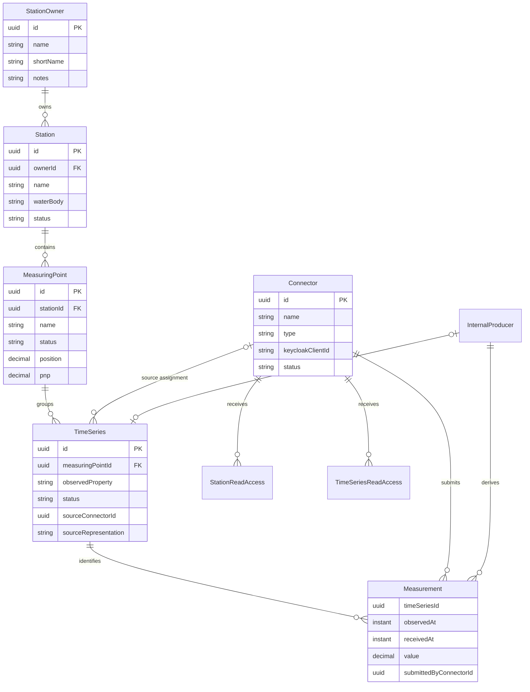

# PegelHub Operational Metadata Catalog

PegelHub's operational catalog is deliberately small. PostgreSQL stores the
metadata hierarchy; InfluxDB stores numeric observations. The application
services keep the write model explicit, while the monitoring module composes a
read model for the operator workflow.

```mermaid
erDiagram
    StationOwner ||--o{ Station : owns
    Station ||--o{ MeasuringPoint : contains
    MeasuringPoint ||--o{ TimeSeries : groups
    Connector o|--o{ TimeSeries : "source assignment"
    Connector ||--o{ StationReadAccess : receives
    Connector ||--o{ TimeSeriesReadAccess : receives
    TimeSeries ||--o{ Measurement : identifies
    Connector ||--o{ Measurement : submits
    InternalProducer o|--o| TimeSeries : "exclusive output"
    InternalProducer ||--o{ Measurement : derives

    StationOwner { uuid id PK string name string shortName string notes }
    Station { uuid id PK uuid ownerId FK string name string waterBody string status }
    MeasuringPoint { uuid id PK uuid stationId FK string name string status decimal position decimal pnp }
    TimeSeries { uuid id PK uuid measuringPointId FK string observedProperty string status uuid sourceConnectorId string sourceRepresentation }
    Connector { uuid id PK string name string type string keycloakClientId string status }
    Measurement { uuid timeSeriesId instant observedAt instant receivedAt decimal value uuid submittedByConnectorId }
```

## Catalog Rules

- `StationOwner` has an identity, name, optional short name, and optional notes.
- `Station` belongs to one owner and has a name, water body, and `active` or
  `inactive` status. There is no station number or free-text location.
- `MeasuringPoint` belongs to one station. Its grouped position contains an
  optional non-negative river kilometer, `left`/`right` bank, and a complete
  WGS84 coordinate pair. PNP is an exact decimal in metres above Adria.
  Water-level references are grouped by a reference-set year and require at
  least one value.
- `TimeSeries` is unique for `(measuringPointId, observedProperty)`. Its
  observed property and point are immutable. Units are derived from the
  observed-property catalog. A nullable source assignment contains a
  Connector and a compatible representation, or one internal producer with
  canonical representation. The origins are exclusive. Ordinary metadata
  edits cannot replace an internal producer assignment.
- `Connector` is a deployed technical client with a curated type, unique
  Keycloak client ID, and shared lifecycle status. Contacts are not catalog
  resources.

## Quality and Notifications

`InternalProducer` identifies a Core capability's scoped read inputs and optional
exclusive output. Quality uses its profile UUID as the stable producer UUID.
Inputs/output must be compatible, active, distinct and acyclic. Every measurement
has exactly one origin: connector or internal producer. Legacy connector Influx
tags stay unchanged; internal measurements use `submittedByInternalProducerId`.

`QualityProfile` is persisted, named configuration: source series, pure rule
settings, recent window, fixed delay, destination IDs and optional derived output.
`QualityRun` snapshots that configuration and records completion/output status.
`Finding` is structured advisory evidence, never a replacement measurement.
Missing/failed/truncated reads are not a clean pass. Derived output is the mean
of all configured latest source values only when their timestamps align and
validation allows it, retaining the observation timestamp.

`Destination` is a named SMTP or SNMP route and an allowlisted deployment
credential reference. `Delivery` snapshots non-secret routing and content,
tracks attempts and a recoverable lease, and records sanitized outcomes.
One run with findings queues one aggregated delivery per enabled selected
destination, including persistent issues on later runs. Acceptance means only
transport acceptance, not receipt. There is no acknowledgement, suppression or
escalation state machine.

Operational history defaults to 90 days. Delivery history is removed before
referenced QA history; pending delivery references keep runs alive. Measurement
retention remains independent. See [ADR 0012](../adr/0012-integrate-quality-and-notifications-in-core.md)
and the Core operations runbook.

The observed-property catalog currently contains `water-level` (`cm`),
`water-temperature` (`Cel`), and `discharge` (`m3/s`). Only water level accepts
`metres-above-adria`; discharge additionally accepts `litres-per-second`. Core
converts both at ingestion and on explicitly represented raw/bucket reads. Water
level conversion uses the current PNP. Default and monitoring reads stay canonical.
See [ADR 0011](../adr/0011-core-measurement-representations.md).

## Authorization

Spring Security enforces coarse authorities at HTTP boundaries. Application
policies then distinguish operator users from connector clients and resolve
resource relationships. A connector can read a station or time series only
through an explicit read-access table. A measurement write additionally needs
an active connector, an active Station -> MeasuringPoint -> TimeSeries path,
and a matching active source assignment. There are no WRITE access grants.

## Monitoring Read Model

`GET /api/v1/monitoring/time-series` returns one row per effectively active
TimeSeries and its latest value in a bounded window. The detail route accepts
inactive series so bookmarked operator pages remain inspectable. Both routes
resolve one window from the injected clock and use one grouped Influx query for
latest values. Chart history remains independently reloadable through
`/time-series/{id}/measurements/buckets`.

Coordinates are intentionally not included in the monitoring projection yet.
German labels, formatting, relative timestamps, and reference-line presentation
remain frontend concerns.
