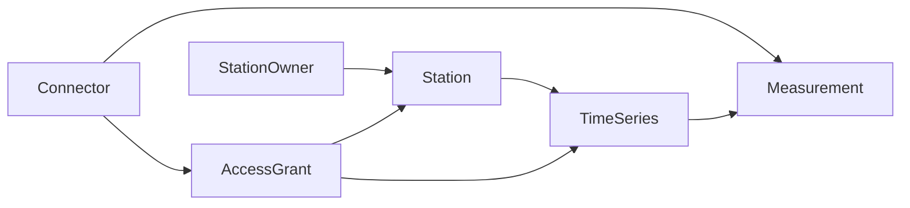

# PegelHub Domain Rewrite Plan

Status: this is the implementation plan for the domain migration. For the current branch architecture, including remaining legacy Contact and Telemetry pieces, use `docs/architecture/pegelhub-domain-model.md`.

This plan prepares the rewrite from the current Supplier/Taker measurement model to the target model described in `CONTEXT.md` and ADR-0001/ADR-0002.

## Problem Statement

PegelHub currently uses Supplier and Taker as core concepts even though they mix several responsibilities. Supplier represents station metadata, data provider identity, connector relation, time-series grouping, refresh behavior, and hydrological reference values. Taker represents a read/export role rather than a durable domain resource. Measurements are written as arbitrary maps and grouped in InfluxDB by Supplier UUID, so the real measurement schema is implicit in connector conventions.

The rewrite should make the domain shape explicit:

- `Connector` is the authenticated technical client.
- `StationOwner` owns or is responsible for stations.
- `Station` is the stable hydrological place.
- `TimeSeries` is one observed series at a station, such as water level, discharge, water temperature, or air temperature.
- `AccessGrant` gives a connector read permission for a station or time series, or write permission for a specific time series.
- `Measurement` is one value for one time series at one observed time.

## Target Model



## Core Contracts

### Measurement Write

Clean Core writes use TimeSeries identity directly:

```text
timeSeriesId
observedAt
value
```

Core derives or checks:

```text
submittedByConnectorId
receivedAt
WRITE AccessGrant for the TimeSeries
```

Core stores:

```text
timeSeriesId
observedAt
receivedAt
value
submittedByConnectorId
```

Protocol-specific values such as station number, IEC IOA, FTP column name, or channel name can exist in connector configuration or compatibility adapters. They do not identify a stored Measurement.

### TimeSeries

A TimeSeries belongs to one Station and describes the value series. It should include at least:

- station identity
- observed property, such as water level, discharge, water temperature, or air temperature
- unit
- optional reference level
- optional external code for connector configuration/discovery

The external code is metadata for mapping, not Measurement identity.

TimeSeries `observedProperty` and `unit` start as validated string codes rather than enums or catalog tables. This avoids blocking the rewrite on a controlled vocabulary while preserving a clear place to add one later.

### AccessGrant

An AccessGrant has:

- subject connector
- resource Station or TimeSeries
- permission: `READ` or `WRITE`

Station-level grants authorize `READ` access to all TimeSeries at the station, including TimeSeries created after the grant. Measurement `WRITE` grants are TimeSeries-scoped.

Direct TimeSeries `WRITE` grants are only valid for the TimeSeries source connector when `sourceConnectorId` is set. Other connectors may still receive `READ` grants for that TimeSeries.

### Telemetry

Technical connector telemetry remains separate from hydrological Measurements. Environmental values that are observed at a station, such as water temperature or air temperature, should become TimeSeries Measurements. Runtime values such as battery voltage, cycle time, IP addresses, software version, and field strength belong to connector telemetry.

## Proposed Package Shape

- `at.pegelhub.connector`: keep and simplify the technical client model.
- `at.pegelhub.stationowner`: new module for StationOwner API/application/domain/persistence.
- `at.pegelhub.station`: new module for Station API/application/domain/persistence.
- `at.pegelhub.timeseries`: new module for TimeSeries API/application/domain/persistence.
- `at.pegelhub.access`: new module for AccessGrant API/application/domain/persistence.
- `at.pegelhub.measurement`: keep the module name, but redefine it around TimeSeries-backed Measurement values.
- `at.pegelhub.shared.influx`: keep as infrastructure, then deepen it into an adapter once the Measurement contract is stable.

## Commit Plan

Each commit should compile and should either keep tests green or update the nearest affected tests in the same commit.

1. Add domain glossary and ADRs.
   Capture the target language and hard decisions before changing code.

2. Introduce target enum/value records with no wiring.
   Add `AccessPermission`, `AccessResourceType`, and small ID/value records only where they reduce ambiguity. Keep TimeSeries observed property and unit as string codes.

3. Add StationOwner domain, DTOs, JPA entity, repository, service, and controller tests.
   Keep it independent from old Contact/Supplier APIs. Use records for new DTOs and JPA repositories for Postgres.

4. Add Station domain, DTOs, JPA entity, repository, service, and controller tests.
   Station references StationOwner by ID. Move only stable station fields first: station number, name, water body/location, and owner.

5. Add TimeSeries domain, DTOs, JPA entity, repository, service, and controller tests.
   TimeSeries references Station by ID and owns observed property, unit, reference level, and optional external code.

6. Add AccessGrant domain, DTOs, JPA entity, repository, service, and tests.
   Grants reference Connector as subject and either Station or TimeSeries as resource. Do not wire Measurement writes yet.

7. Add AccessGrant authorization service.
   Provide a small application interface for checking whether the current Connector can `READ` or `WRITE` a Station or TimeSeries.

8. Redefine Measurement write DTOs.
   Replace `fields`/`infos` write maps with `timeSeriesId`, `observedAt`, `value`. Add Jakarta Bean Validation annotations and use `@Valid` at controller boundaries.

9. Redefine Measurement domain records.
   Replace the current Influx-shaped `Measurement(UUID measurement, timestamp, fields, infos)` with a TimeSeries-backed Measurement. Include `observedAt`, `receivedAt`, `value` and submitted Connector identity.

10. Rewrite MeasurementService write path.
    Resolve the current actor to Connector, check active connector state, check WRITE AccessGrant for the TimeSeries, set `receivedAt`, and persist the Measurement.

11. Rewrite InfluxMeasurementRepository for the new Measurement shape.
    Store points grouped by TimeSeries identity. Write `value` as the main field and store submitted connector. Preserve UTC `Instant` handling.

12. Rewrite Measurement query APIs.
    Query by TimeSeries and range first. Add station-level query only after it is backed by Station -> TimeSeries lookup, not by old Supplier lookup.

13. Update connector library Measurement model and HTTP client.
    Send the clean write payload. Remove `fields`/`infos` as the primary outbound contract.

14. Update connectors one by one to produce TimeSeries-backed measurements.
    For connectors that currently know only protocol addresses, add local configuration that maps those addresses to TimeSeries IDs.

15. Remove Supplier write path and Supplier-backed measurement queries.
    Delete or replace Supplier service/repository/controller tests that only exist to support the old write identity.

16. Remove Taker as a core authorization concept.
    Replace read/export behavior with Connector capabilities plus AccessGrant READ checks.

17. Revisit Telemetry.
    Split station-observed telemetry values into TimeSeries Measurements where appropriate, and keep technical runtime values in a connector telemetry model. Do this after the main Measurement rewrite so it does not blur the model.

18. Deepen Influx infrastructure.
    Replace static `ConnectionHelper` usage with a Spring-managed adapter if the new Measurement repository still exposes too many Influx details.

19. Update docs and API examples.
    Rewrite the bruno api (not here in the repo /Users/markusfehringer/Documents/bruno/PegelHub Core API)/API docs around StationOwner, Station, TimeSeries, AccessGrant, and Measurement.

20. Remove old compatibility names from testsupport and fixtures.
    `ExampleData`, `ExampleDtos`, and workflow tests should speak the new language.

## Schema Migration Shape

The rewrite can use fresh JPA tables during branch development:

- `station_owner`
- `station`
- `time_series`
- `access_grant`

The old `Supplier`, `Taker`, `StationManufacturer`, and `TakerServiceManufacturer` tables should be removed once their API surfaces are gone. Because this is a big rewrite on an early solo-developed application, the branch does not need a long-lived dual-write or compatibility migration unless deployment data must be preserved.

## Testing Decisions

Test behavior through module interfaces, not mapper internals.

Core narrow tests:

- StationOwner controller/service/repository tests.
- Station controller/service/repository tests.
- TimeSeries controller/service/repository tests.
- AccessGrant authorization tests.
- MeasurementService write authorization tests.
- InfluxMeasurementRepository integration tests for write, range query, latest query, and average if averages remain.

Core broad tests:

- Metadata persistence integration test rewritten for Connector -> StationOwner -> Station -> TimeSeries -> AccessGrant.
- Full-stack workflow integration test rewritten around clean Measurement writes.
- Auth policy matrix updated for new routes and permissions.

Connector tests:

- Connector library HTTP tests for clean Measurement write payload.
- One connector at a time: verify protocol value -> configured TimeSeries ID -> clean Measurement payload.

Verification commands:

```bash
bash .agents/skills/pegelhub-local-dev/scripts/pegelhub-local-dev.sh test-core
mvn -f connectors/library/pom.xml test
mvn -f connectors/iec-connector/pom.xml test
mvn -f connectors/ftp-connector/pom.xml test
mvn -f connectors/tstp-connector/pom.xml test
mvn -f connectors/ma-connector/pom.xml test
mvn -f connectors/icc-connector/pom.xml test
```

## Out Of Scope For The First Rewrite Pass

- MetadataProposal review flows.
- Long-lived backwards compatibility for old Supplier/Taker APIs.
- Automatic discovery of unknown TimeSeries from connector traffic.
- A full unit ontology or custom observed-property registry.
- Changing Keycloak as the authentication provider.
- Optimizing Influx write batching before the new Measurement contract is stable.

## Resolved Decisions

- Clean Measurement writes use `timeSeriesId` directly.
- Protocol-specific channel/address mapping stays outside the core Measurement identity.
- TimeSeries observed property and unit start as string codes.
- TimeSeries may define an optional `sourceConnectorId` during metadata configuration; if present, only that connector can write source Measurements for the TimeSeries.
- Station-level AccessGrants include future TimeSeries.
- Technical connector telemetry is separate from hydrological Measurements.
- Averages are derived aggregates and are returned as `MeasurementAverage`, not as observed Measurements.
